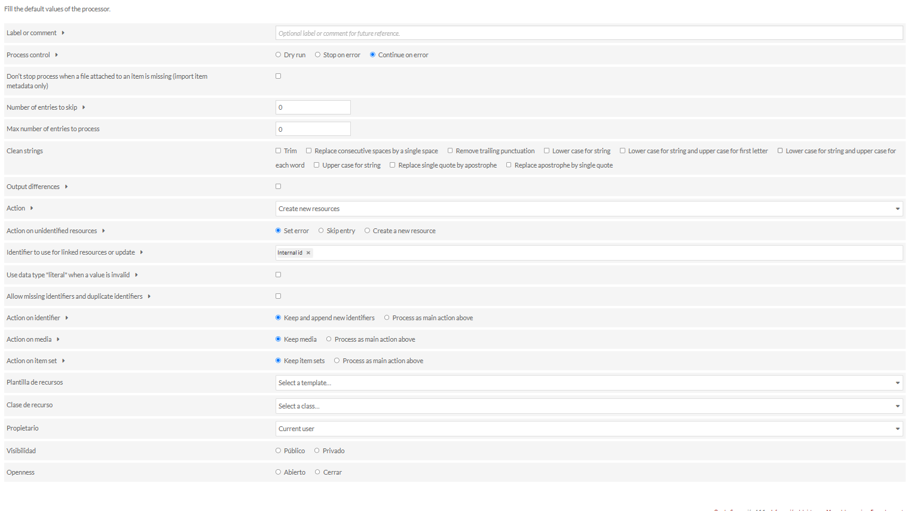
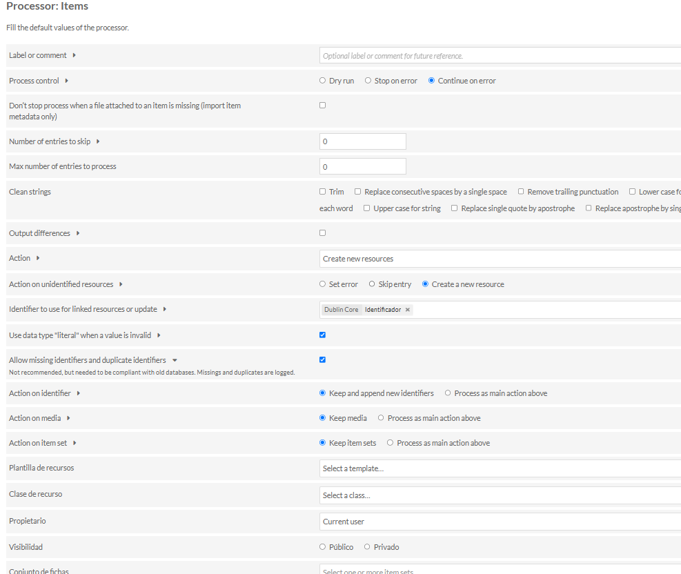
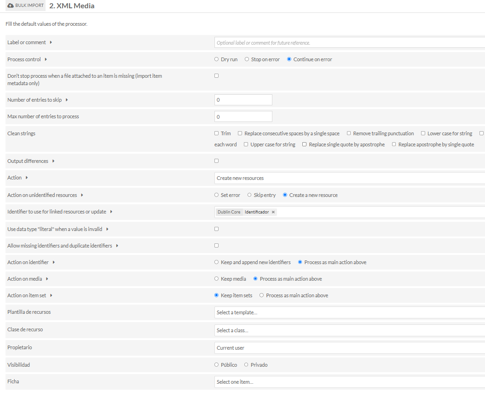

### Plan de migración de la Mediateca Wordpress a Omeka S

### Migración de mediateca de ATE a Servidor de Desarrollo (Referencia)

1.  **Pasos previos a la carga de archivos XML**
    *   **Añadir extensiones a la configuración de OMEKA-S**:
        *   Para permitir la subida de nuevos tipos de archivo, navegue en la interfaz de administración de Omeka S a `Global Settings > Security`. En el campo "Allowed File Extensions" (Extensiones de archivo permitidas), añada las siguientes extensiones (separadas por comas): `eps`, `vtt`, `zip`.
        *   A continuación, vaya a `Admin > Vocabularies > MIME Types` (o `Admin > Settings > Media Types` o similar, dependiendo de la versión de Omeka S y los módulos activados). Asegúrese de que los siguientes tipos MIME estén presentes o añádalos:
            *   `application/postscript` (para .eps)
            *   `image/x-eps` (alternativo para .eps)
            *   `text/vtt` (para .vtt)
            *   `application/zip` o `application/x-zip-compressed` (para .zip)
    *   Procesado de medios EPS: ejecutar en servidor:
    ```bash
    sed -i 's|<policy domain="coder" rights="none" pattern="EPS" />|<!-- <policy domain="coder" rights="none" pattern="EPS" /> -->|' /etc/ImageMagick-6/policy.xml
    ```
    *   **Importación de plantillas de recursos**:
        *   Estas plantillas definen la estructura de metadatos para tipos específicos de recursos en Omeka S. Se trata de archivos JSON que se importan a través de la interfaz de Omeka.
        *   **Plantilla autores**: Navegue a `Admin > Templates`. Haga clic en el botón "Import" y seleccione el archivo `Assets/Templates/autor.json`. Confirme la importación. Esta plantilla se usará para los items que representan autores.
        *   **Plantilla Categoría**: Repita el proceso anterior. Navegue a `Admin > Templates`. Haga clic en "Import" y seleccione el archivo `Assets/Templates/categoria.json`. Confirme la importación. Esta plantilla podría usarse para los ItemSets si se requiere una estructura específica más allá de los campos básicos.
    *   **Realizar la migración de los autores `<wp:authors>`**:
        *   Usar el fichero **autores_csv.csv**
        *   **Bulk import => Importación de items CSV (Módulo `CSV Import`)**: Utilizar el módulo `CSV Import` de Omeka S para importar los autores como items individuales.
            *   **1ra pasada: Creación de recursos**:
                *   **Plantilla de Recurso**: Utilizar la plantilla "autores" importada previamente.
                *   **Mapeo**: Mapear las columnas del CSV a los campos correspondientes de la plantilla "autores" (e.g., `author_display_name` a `dcterms:title`, `author_id` a `dcterms:identifier`).
                *   **Acción**: Seleccionar "Create new items".
                *   **Identificador único**: Especificar la columna del CSV `author_id`.
            *   **2da pasada: Append data to resources**:
                *   **Identificador**: Usar el campo mapeado a `dcterms:identifier` (`author_id` de WP).
                *   **Acción**: Seleccionar "Append to existing items", "Replace in existing items" o "Update existing items".
2.  **Configuración Módulo `Bulk Import`**:
    *   Las siguientes configuraciones son para el módulo `Bulk Import`. Usar rutas `Mapping/` y `xsl/`.
    *   **0. WP XML-ItemSets (Importación de Colecciones/Categorías)**
        *   **Mapper**: `Mapping/mapper_wp_xml_itemsets.xml`
        *   **Procesor**: Item Set
        *   **XSL Proc**: `xsl/xsl_omeka_itemset.xsl`
        *   **Params**: (Según se definan en la interfaz del módulo `Bulk Import` si el XSL los requiere).
        *   **Pestaña Processor**
            
    *   **1. WP XML- Items (Importación de Entradas/Items Principales)**
        *   **Mapper**: `Mapping/mapper_wp_post_omeka_items.xml`
        *   **Procesor**: Items
        *   **XSL Proc**: `xsl/xsl_item_preprocessor.xsl`
        *   **Params**:
            ```bash
            postType=attachement
            postParent=0
            Media=0
            ```
        *   **Pestaña Processor**
            
    *   **2. WP XML - Media (Importación de Medios Adjuntos a los Items)**
        *   **Mapper**: `Mapping/mapper_wp_post_omeka_media.xml`
        *   **Procesor**: Media
        *   **XSL Proc**: `xsl/xsl_item_preprocessor.xsl`
        *   **Params**:
            ```bash
            postType=attachement
            postParent=0
            Media=1
            ```
        *   **Pestaña Processor**
            
3.  **Importación de colecciones (Secuencia de ejecución con `Bulk Import`)**:
    *   **0.WP ML-ItemSets**
    *   **1.WP XML-Items**
    *   **2.WP XML-Media**


